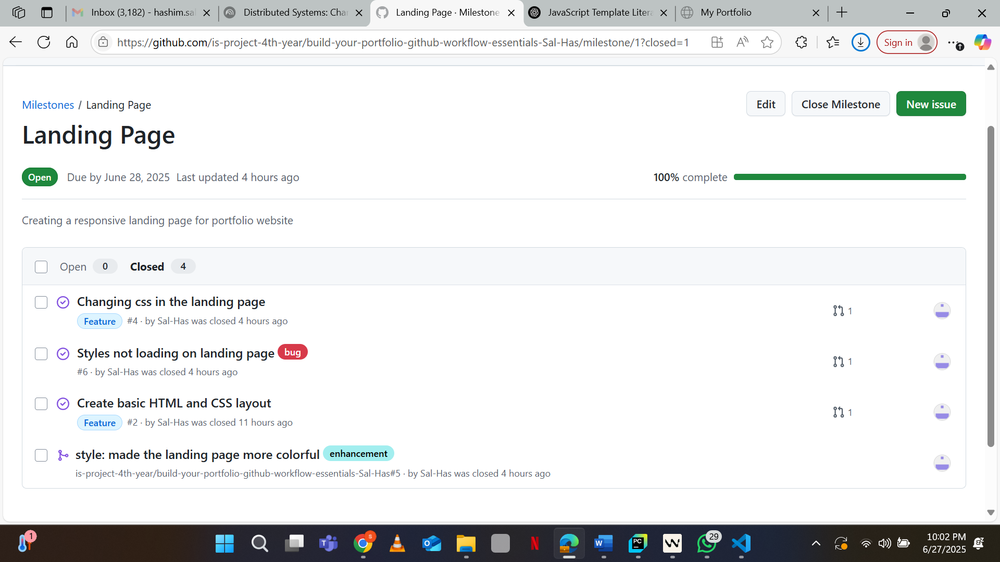
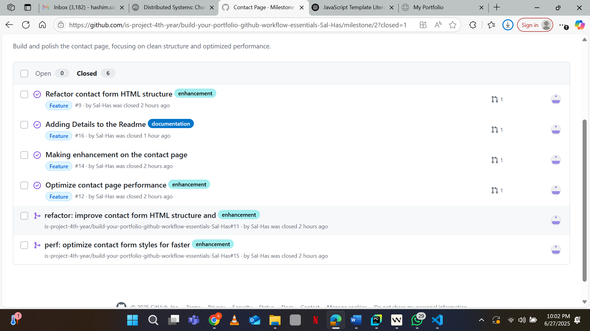
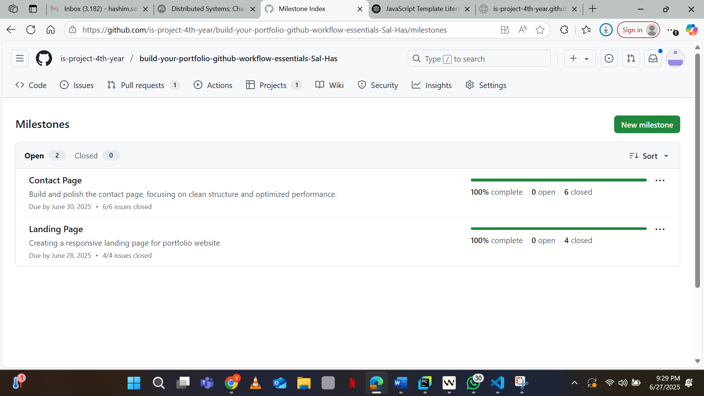
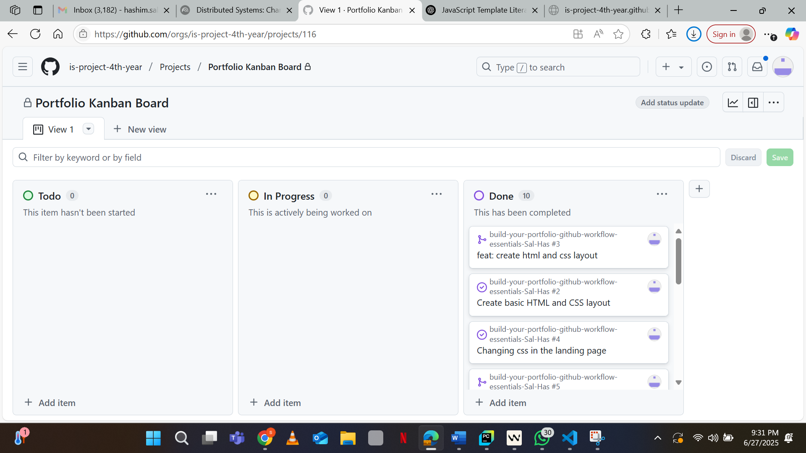
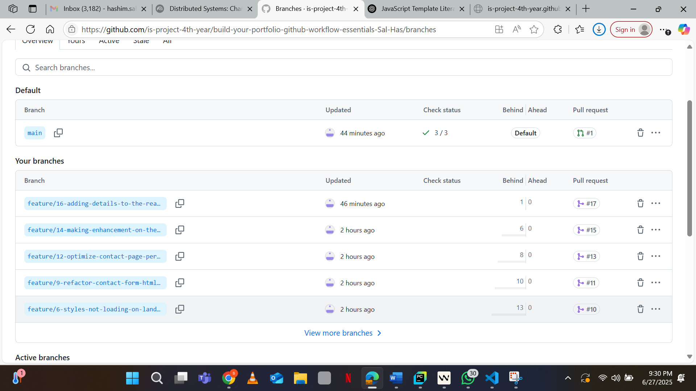
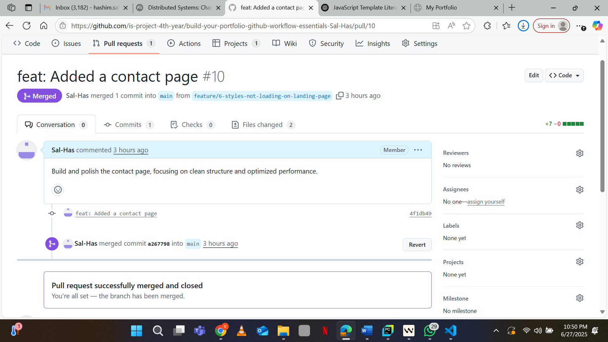
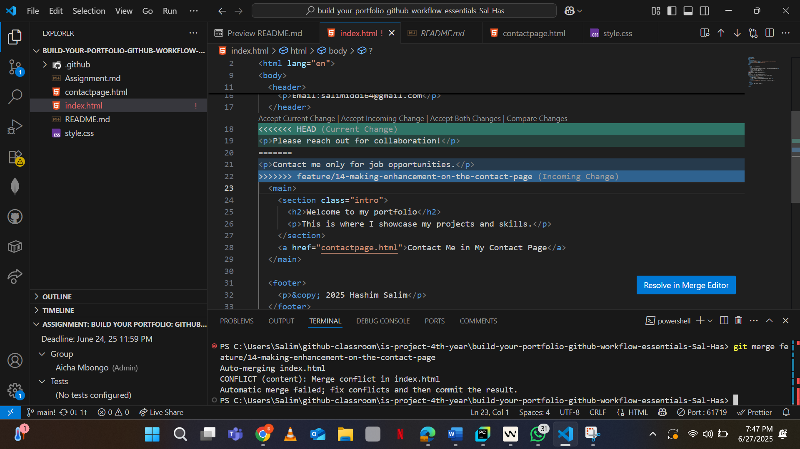
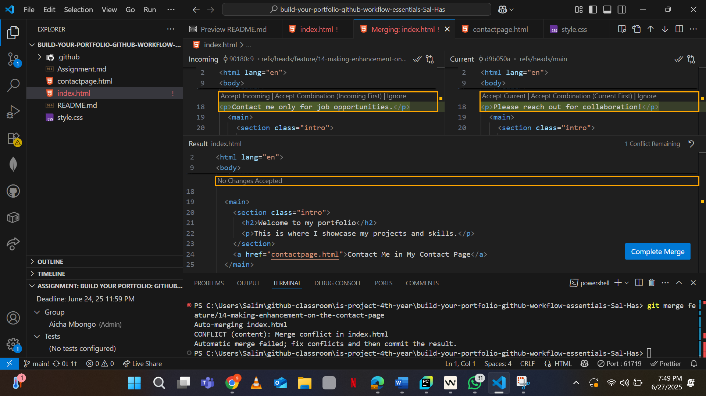

# Personal Portfolio Documentation

## 1. Student Details

- **Full Name**:Salim Hashim Iddi
- **GitHub Username**:Sal-Has
- **Email**:hashim.salim@strathmore.edu

## 2. Deployed Portfolio Link

- **GitHub Pages URL**:  
   https://is-project-4th-year.github.io/build-your-portfolio-github-workflow-essentials-Sal-Has/

## 3. Learnings from the Git Crash Program
## 📘 What I Have Learned

- **Branching**: Helped me separate features and prevent conflicts when working on different sections of the site. It allowed me to work on tasks like the contact page or styling without affecting the main project until changes were ready.

- **Merge Conflict Resolution**: Taught me how to identify and fix conflicts when two branches have different changes to the same file. I practiced resolving them using Visual Studio Code and understood how Git marks conflicting sections clearly.

- **Conventional Commits**: Helped me write consistent and meaningful commit messages using prefixes like `feat:`, `fix:`, `refactor:`, `perf:`, and `docs:`. This made it easier to understand the purpose of each change and link commits to specific issues.

### A. Milestones and Issues

 
This screenshot shows the "Landing Page" milestone I created, with issues grouped under it for layout and styling tasks.

### Milestone: Contact Page

  
This screenshot shows the "Contact Page" milestone, where I created separate issues for refactoring the HTML and improving performance.

### Milestone Overview

  
This screenshot displays the full list of milestones in the repository, each representing a major section of the portfolio project.
### B. Project Board

  
This screenshot shows my GitHub Project Board with issues categorized into **To Do**, **In Progress**, and **Done** columns. It helped me track the progress of each task related to building and refining my personal portfolio.

### C. Branching

  
This screenshot displays my Git branches with clear, descriptive names such as `feature/16-adding-details-to-the-readme` Using meaningful branch names helped keep the project organized and made it easier to know the purpose of each branch.

### D. Pull Requests

  
This screenshot shows a pull request where I used a Conventional Commit message (e.g., `feat: Added a contact page`) and linked it to **Issue #6**. This helps track progress and automatically closes the issue when the PR is merged.

### E. Merge Conflict Resolution

  
This screenshot shows a failed merge because it encountered a **merge conflict** because the same file was modified in two different branches. GitHub flagged the conflict and required manual resolution before merging.

---

  
This screenshot shows the same merge conflict being  resolved.
